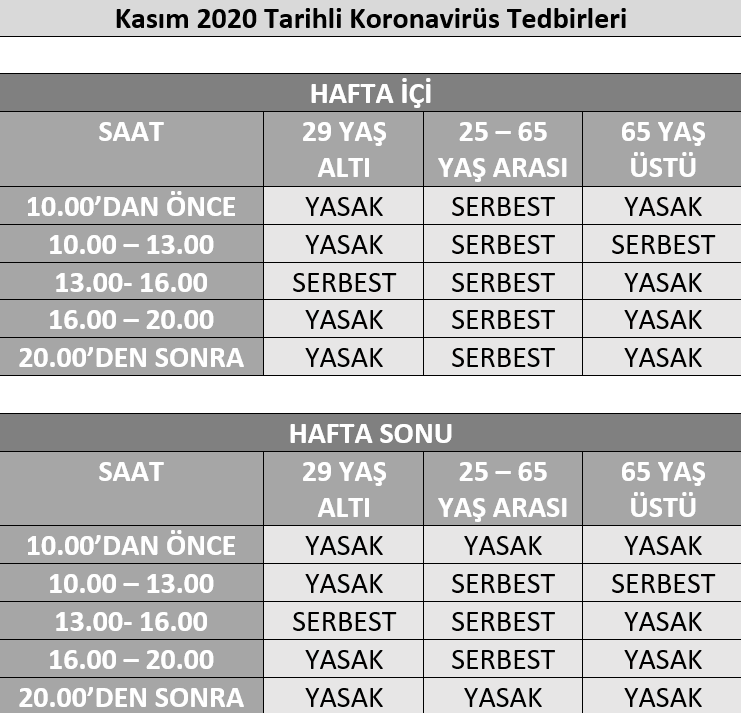
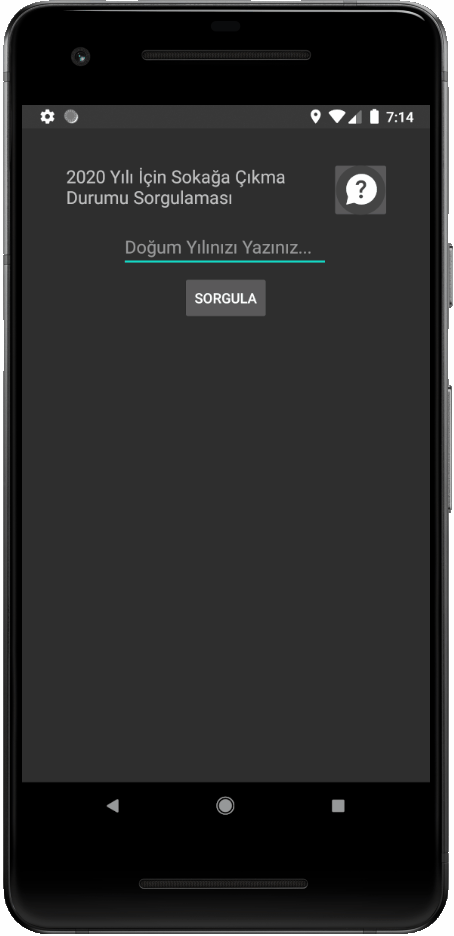
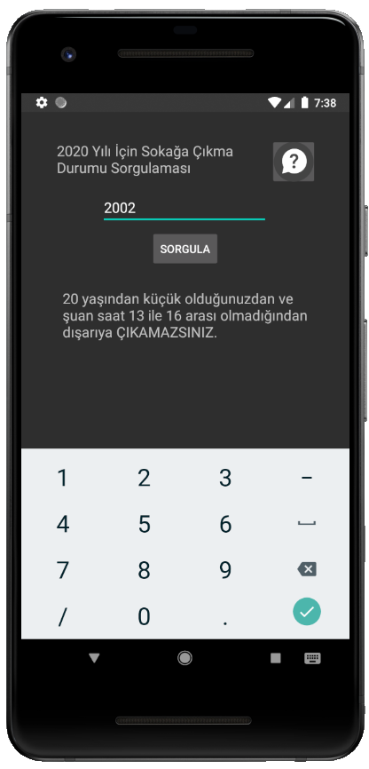
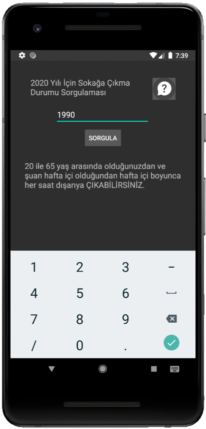
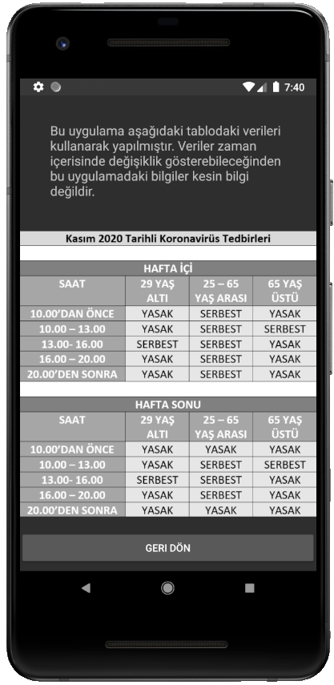

# Android Evde Kal 2020

Java ile yazılan bu Android uygulamamda Kasım 2020 de alınan koronavirüs tedbirleri gereğince kullanıcıdan doğum yılı alınarak o an ne yapması gerektiğini ekrana yazdırttım.
Uygulama aşağıdaki tabloya göre çalışmaktadır.

---

# Ekran Görüntüleri

